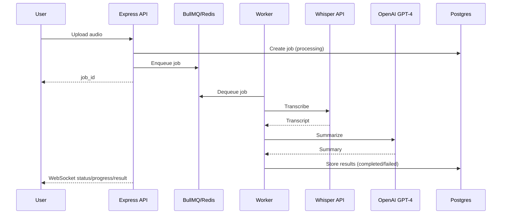

# STT 語音摘要服務

這是一個可 Docker 化的 Node.js 後端服務，提供音訊上傳、Whisper STT 轉錄、OpenAI GPT-4 摘要，並透過 WebSocket 即時回報進度。前端使用 React Demo UI。

## 環境需求
- Docker + Docker Compose
- (可選) psql client 用於執行 SQL migration

## 快速啟動
1. 複製環境設定檔：

```sh
cp .env.example .env
```

2. 啟動服務：

```sh
docker-compose up --build
```

3. 套用 migration（一次性）：

```sh
psql "$DATABASE_URL" -f db/migrations/001_create_jobs.sql
```

## 架構理念與用途
本專案採用 Clean Architecture + DDD 分層，將核心業務規則與外部技術細節分離，目標是可維護、可測試、可擴充：
- **Domain**：任務狀態與核心規則，無框架依賴。
- **Use Cases**：把需求流程封裝成可測試的應用案例。
- **Adapters**：把 DB、Queue、外部 AI、檔案系統轉接成 domain ports。
- **Infrastructure**：連線、環境設定、系統時鐘、UUID 等底層實作。
- **Apps**：API 與 Worker 入口，組裝所有依賴並對外提供服務。

## 系統架構循序圖（Mermaid）


## 資料流說明
- **建立任務**：API 收到音檔 → 寫入檔案 → 建立 Job → 入列 Queue → 回傳 `processing`。
- **背景處理**：Worker 取出任務 → Whisper 轉錄 → OpenAI 摘要 → 更新 DB → 發送 WS 事件。
- **即時回報**：API 的 WebSocket 訂閱 Redis Pub/Sub，將狀態推給前端。
- **歷史列表**：前端透過 `GET /api/jobs` 取得最新任務清單。
- **清理**：Worker 每日清理超過 7 天的任務與檔案。

## API
Base URL: `http://localhost:3000`

### 建立任務
`POST /api/jobs`
- Content-Type: `multipart/form-data`
- 欄位：`file`（.wav/.mp3，最大 20MB）

回應 (202)：
```json
{
  "job_id": "uuid",
  "status": "processing",
  "created_at": "2026-01-15T22:10:00Z"
}
```

### 查詢任務
`GET /api/jobs/:jobId`

回應 (200)：
```json
{
  "job_id": "uuid",
  "status": "pending|processing|completed|failed",
  "transcript": "string|null",
  "summary": "string|null",
  "error": "string|null",
  "created_at": "...",
  "updated_at": "..."
}
```

### 任務列表
`GET /api/jobs?limit=20`

回應 (200)：
```json
{
  "jobs": [
    {
      "job_id": "uuid",
      "status": "pending|processing|completed|failed",
      "transcript": "string|null",
      "summary": "string|null",
      "error": "string|null",
      "created_at": "...",
      "updated_at": "..."
    }
  ]
}
```

### 健康檢查
`GET /api/health`

## WebSocket
- URL: `ws://localhost:3000/ws`
- Subscribe：

```json
{ "type": "subscribe", "job_id": "uuid" }
```

事件範例：
```json
{ "type": "status", "job_id": "uuid", "status": "pending|processing|completed|failed" }
{ "type": "progress", "job_id": "uuid", "stage": "transcribing|summarizing", "message": "..." }
{ "type": "result", "job_id": "uuid", "transcript": "...", "summary": "..." }
{ "type": "error", "job_id": "uuid", "error": "..." }
```

## Demo UI
UI 為獨立的 React 專案：

```sh
cd ui
npm install
npm run dev
```

啟動後開啟 Vite 顯示的 URL，若需要可將 API Base 設為 `http://localhost:3000`。

## 保留策略
任務與檔案會在 7 天後由每日清理 worker 移除。

## 架構文件
- 規格：`docs/spec.zh-TW.md`
- 結構：`docs/architecture/structure.md`
- Ports：`docs/architecture/ports-interfaces.md`
- ADRs：`docs/adr/`
