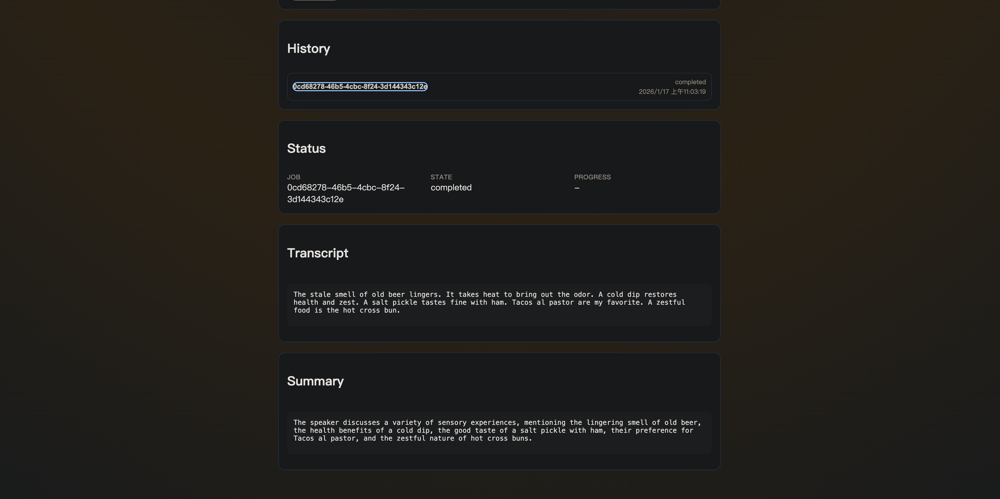
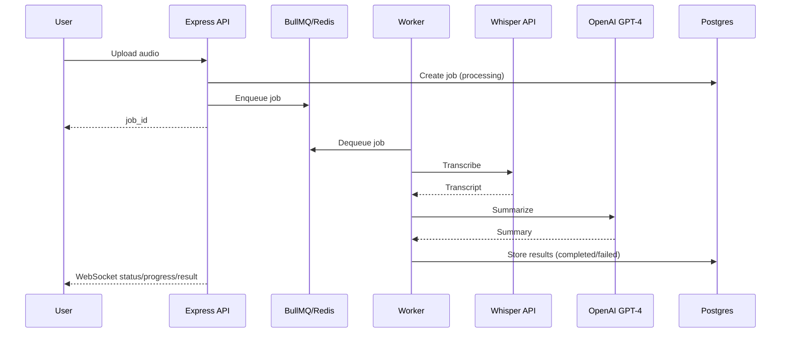

# STT lite project

Docker 化的 Node.js 後端服務，提供音訊上傳、Whisper STT 轉錄、OpenAI GPT-4 摘要，並透過 WebSocket 即時回報進度。前端使用 React Demo UI。

整個專案非一次性請 AI generate，而是與 AI 一同協作

實際操作影片（點擊圖片觀看 youtube link）：
[](https://youtu.be/etYGK0Q1NWg)

## 快速啟動

1.複製環境設定檔：

```sh
cp .env.example .env

# 補上 OpenAI API key
# OPENAI_API_KEY=changeme
# WHISPER_API_KEY=changeme
```

2.啟動服務：

```sh
docker-compose up --build
```

3.套用 migration（一次性）：

```sh
psql "$DATABASE_URL" -f db/migrations/001_create_jobs.sql

# 或是直接連線 localhost:5432 進 DB 執行 query
```

4.啟動 UI 介面

```sh
cd ui
npm install
npm run dev

# 開啟 browser localhost:5173
```

## 架構理念與用途

本作業採用 Clean Architecture + DDD 分層，將 domain logic 與 external adapter 細節分離：

- **Domain**：任務狀態與核心規則，無框架 dependencies，可獨立測試。
- **Use Cases**：把需求流程包裝成可測試的 use case。
- **Adapters**：把 DB、Queue、外部 AI、檔案系統借接成 domain ports。
- **Infrastructure**：連線、環境設定、系統時間、UUID 等底層實作。
- **Apps**：API 與 Worker 入口，組裝所有 dependencies 並對外提供服務。

## 系統架構循序圖（Mermaid）



## 資料流說明

- **建立任務**：API 收到音檔 → 寫入檔案 → 建立 Job → 入列 Queue → 回傳 `processing`。
- **背景處理**：Worker 取出 job → Whisper 轉錄 → OpenAI 摘要 → 更新 DB → 發送 WS 事件。
- **即時回報**：API 的 WebSocket 訂閱 Redis Pub/Sub，將狀態推給前端。
- **歷史列表**：前端透過 `GET /api/jobs` 取得最新 job清單。
- **清理**：Worker 每日清理超過 7 天的 job與檔案。

## API Doc

Base URL: `http://localhost:3000`

### 建立任務

`POST /api/jobs`

- Content-Type: `multipart/form-data`
- 欄位：`file`（.wav/.mp3，最大 20MB）

回應 (202)：

```json
{
  "job_id": "uuid",
  "status": "processing",
  "created_at": "2026-01-15T22:10:00Z"
}
```

### 查詢任務

`GET /api/jobs/:jobId`

回應 (200)：

```json
{
  "job_id": "uuid",
  "status": "pending|processing|completed|failed",
  "transcript": "string|null",
  "summary": "string|null",
  "error": "string|null",
  "created_at": "...",
  "updated_at": "..."
}
```

### 任務列表

`GET /api/jobs?limit=20`

回應 (200)：

```json
{
  "jobs": [
    {
      "job_id": "uuid",
      "status": "pending|processing|completed|failed",
      "transcript": "string|null",
      "summary": "string|null",
      "error": "string|null",
      "created_at": "...",
      "updated_at": "..."
    }
  ]
}
```

### 健康檢查

`GET /api/health`

## WebSocket

- URL: `ws://localhost:3000/ws`
- Subscribe：

```json
{ "type": "subscribe", "job_id": "uuid" }
```

Event 範例：

```json
{ "type": "status", "job_id": "uuid", "status": "pending|processing|completed|failed" }
{ "type": "progress", "job_id": "uuid", "stage": "transcribing|summarizing", "message": "..." }
{ "type": "result", "job_id": "uuid", "transcript": "...", "summary": "..." }
{ "type": "error", "job_id": "uuid", "error": "..." }
```

## 架構文件

- 規格：[`docs/spec.zh-TW.md`](docs/spec.zh-TW.md)
- 結構：[`docs/architecture/structure.md`](docs/architecture/structure.md)
- Ports：[`docs/architecture/ports-interfaces.md`](docs/architecture/ports-interfaces.md)
- ADRs：[`docs/adr/`](docs/adr/)

## 補充

因為時間有限，只有實作 spec 上功能的 mvp，以下列出可以 production 的優化想法

- 在 transcript 跟 summary 的部分如果遇到大檔案，可以使用 streaming pipeline 的方式做 partial transcript 跟 summary
- 未來業務邏輯更複雜的時候 DDD 架構可以再跟深層一些，補上 ACL 保護 DTO 與 DAO 的分界，因為功能簡單這邊不實作
- 部署部分，傾向用 gitops 流程，成本考量可以用 serverless 實作，預算許可的話會使用 k8s 處理，queue 的部分會傾向使用 GCP pubsub 來處理，簡單好用好監控
- Monitoring 可以補上，除了加 tracing span or prometheus 基本 metric 之外，個人想法是可以針對 LLM 流程去做監控，分成 STT 一段，LLM 一段，summary 一段，未來如果功能複雜使用 agentic 流程的話，可以考慮加上 agent 監控，觀察 agent 想法或是工具選用是否符合預期
- UI 我是完全用 AI 寫因為不是本職學能
- 可以補上多 model 服務選項，不是只有 OpenAI model 可以選
