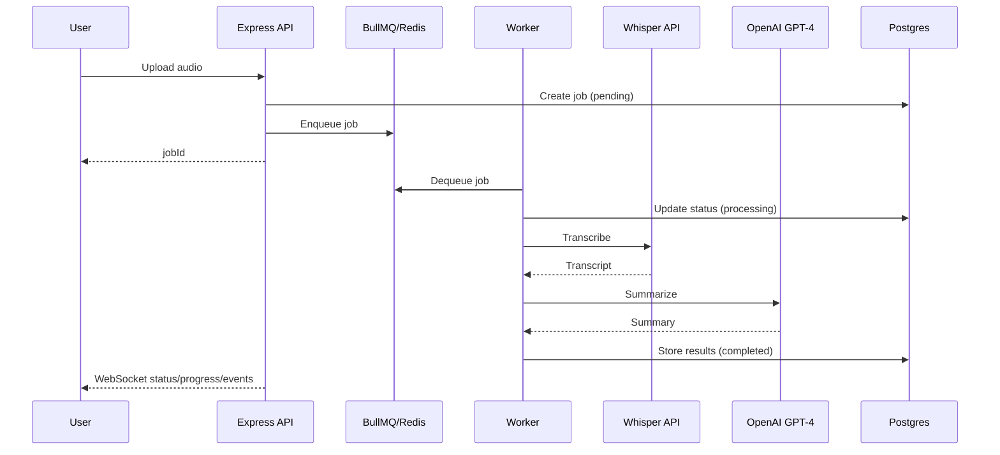

# Speech-to-Text Summarization Server 規格書（繁體中文）

最後更新：2026-01-15

## 1. 問題陳述
本專案需建立一個可部署的後端服務，接受使用者上傳音訊檔（.wav/.mp3），以 Whisper API 轉錄文字，再使用 OpenAI GPT-4 進行摘要，並提供非同步查詢與即時進度回報。系統必須可透過 `docker-compose up` 一鍵啟動，並附帶簡易 React 前端與架構圖說明。

## 2. 功能需求
- 提供音訊檔上傳 API，立即回傳 `jobId`，不可同步阻塞 STT/LLM。
- 建立任務回應狀態為 `processing`，前端透過 WebSocket 即時追蹤結果。
- 任務狀態必須包含 `pending / processing / completed / failed`。
- Worker 非同步處理流程：STT 轉錄 -> LLM 摘要 -> 儲存結果。
- 可查詢任務結果（原文 transcript、摘要 summary、錯誤訊息）。
- 提供任務列表 API 供前端顯示歷史紀錄。
- 以 WebSocket 即時回傳任務進度與狀態。
- 提供簡易 React 前端，可上傳檔案、查詢結果、顯示狀態與摘要。
- 前端啟動後自動訂閱歷史任務，無需手動 Subscribe 即可即時更新。
- 前端需包含歷史紀錄列表與詳情頁面（無 API 先以前端暫存實作）。
- 需提供架構圖或流程圖（Mermaid 即可）。
- 需提供 README（啟動方式、API 規格、設定方式）。

## 3. 技術規範（已確認）
- Backend：Node.js + Express 使用 Domain driven design 與 clean code 架構
- Queue/Worker：BullMQ + Redis
- Data Storage：Postgres
- STT：Whisper API
- LLM：OpenAI API，model 使用 `gpt-4`
- Realtime：WebSocket
- Frontend：React
- 部署：Dockerfile + docker-compose
- 設定：全部透過 `.env` 或環境變數

## 4. 非功能需求
- 上傳不可阻塞處理（非同步必須）。
- 明確錯誤處理，失敗任務須記錄錯誤訊息。
- 需要可追蹤的任務狀態與處理步驟紀錄（log）。
- 模組化程式結構與清楚命名。

## 5. 限制與政策
- 檔案大小限制：20MB。
- 資料保留：7 天（到期需清理 DB 與檔案）。
- transcript / summary 必須以音檔原語言回傳。

## 6. API 規格
### 6.1 建立任務
`POST /api/jobs`
- Content-Type: `multipart/form-data`
- 欄位：`file`
- 成功回傳 (202)：
```json
{
  "jobId": "uuid",
  "status": "processing",
  "createdAt": "2026-01-15T22:10:00Z"
}
```
- 錯誤：
  - 400：缺少檔案
  - 413：超過 20MB
  - 415：非支援音訊格式

### 6.2 查詢任務
`GET /api/jobs/:jobId`
- 回傳 (200)：
```json
{
  "jobId": "uuid",
  "status": "pending|processing|completed|failed",
  "transcript": "string|null",
  "summary": "string|null",
  "error": "string|null",
  "createdAt": "...",
  "updatedAt": "..."
}
```

### 6.3 任務列表
`GET /api/jobs?limit=20`
- 回傳 (200)：
```json
{
  "jobs": [
    {
      "job_id": "uuid",
      "status": "pending|processing|completed|failed",
      "transcript": "string|null",
      "summary": "string|null",
      "error": "string|null",
      "created_at": "...",
      "updated_at": "..."
    }
  ]
}
```

### 6.4 健康檢查
`GET /api/health` -> `200 OK`

## 7. WebSocket 規格
- 連線 URL：`ws://host/ws`
- Client 訂閱：
```json
{ "type": "subscribe", "jobId": "uuid" }
```
- Server 事件：
```json
{ "type": "status", "jobId": "uuid", "status": "pending|processing|completed|failed" }
{ "type": "progress", "jobId": "uuid", "stage": "transcribing|summarizing", "message": "..." }
{ "type": "result", "jobId": "uuid", "transcript": "...", "summary": "..." }
{ "type": "error", "jobId": "uuid", "error": "..." }
```

## 8. 資料模型（Postgres）
- `jobs`
  - `id` (uuid, pk)
  - `status` (enum: pending/processing/completed/failed)
  - `original_filename` (text)
  - `audio_path` (text)
  - `transcript` (text, nullable)
  - `summary` (text, nullable)
  - `error` (text, nullable)
  - `created_at` (timestamp)
  - `updated_at` (timestamp)
  - `expires_at` (timestamp)

## 9. 背景工作流程（Worker）
1. 讀取任務並更新狀態為 `processing`。
2. 呼叫 Whisper API 取得 transcript。
3. 呼叫 OpenAI GPT-4 取得 summary。
4. 儲存 transcript / summary，狀態改為 `completed`。
5. 失敗時記錄錯誤並標記 `failed`。
6. 透過 WebSocket 即時推送進度。

## 10. Retention 清理策略
- 排程工作（可用 BullMQ repeatable job 或 cron）每日清理 `expires_at < now()` 的資料與檔案。

## 11. 架構/流程圖（Mermaid）


## 12. 架構文件（補充）
- 資料夾結構：`docs/architecture/structure.md`
- Ports/Interfaces：`docs/architecture/ports-interfaces.md`
- ADR 模板：`docs/adr/0000-template.md`
- ADR 範例（重試與 DLQ）：`docs/adr/0001-retry-dlq.md`

## 13. 交付物
- 完整原始碼（含 Dockerfile、docker-compose.yml）。
- README：專案介紹、啟動方式、API 規格、環境變數說明。
- React 前端頁面（上傳/查詢/顯示結果）。
- 架構圖（可放於 README 或 docs/）。

## 14. 環境變數（建議）
- `PORT`
- `DATABASE_URL`
- `REDIS_URL`
- `OPENAI_API_KEY`
- `OPENAI_MODEL=gpt-4`
- `WHISPER_API_KEY`
- `UPLOAD_DIR`

## 15. 未決事項
- 無。已全部確認。
